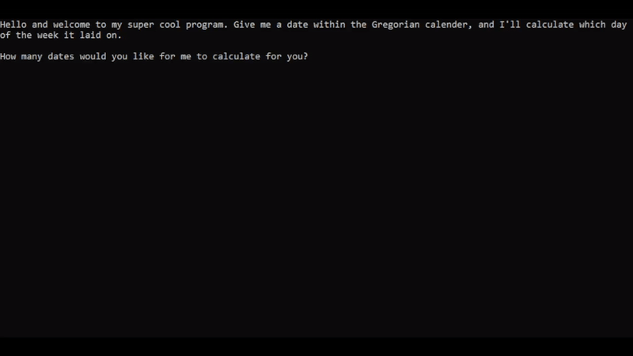

# day-date-calculator

This program allows users to input a date, and then returns what day of the week that date would fall on. This assumes we are using the Gregorian calendar (with which most of us today are familiar). For more information on the adoption of the Gregorian calendar, see this page from the University of Nottingham: https://www.nottingham.ac.uk/manuscriptsandspecialcollections/researchguidance/datingdocuments/juliangregorian.aspx

The algorithm used in this program is based off of this Numberphile video: https://www.youtube.com/watch?v=z2x3SSBVGJU
